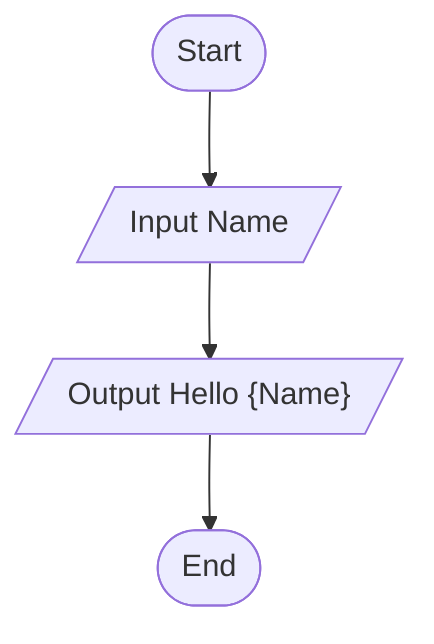
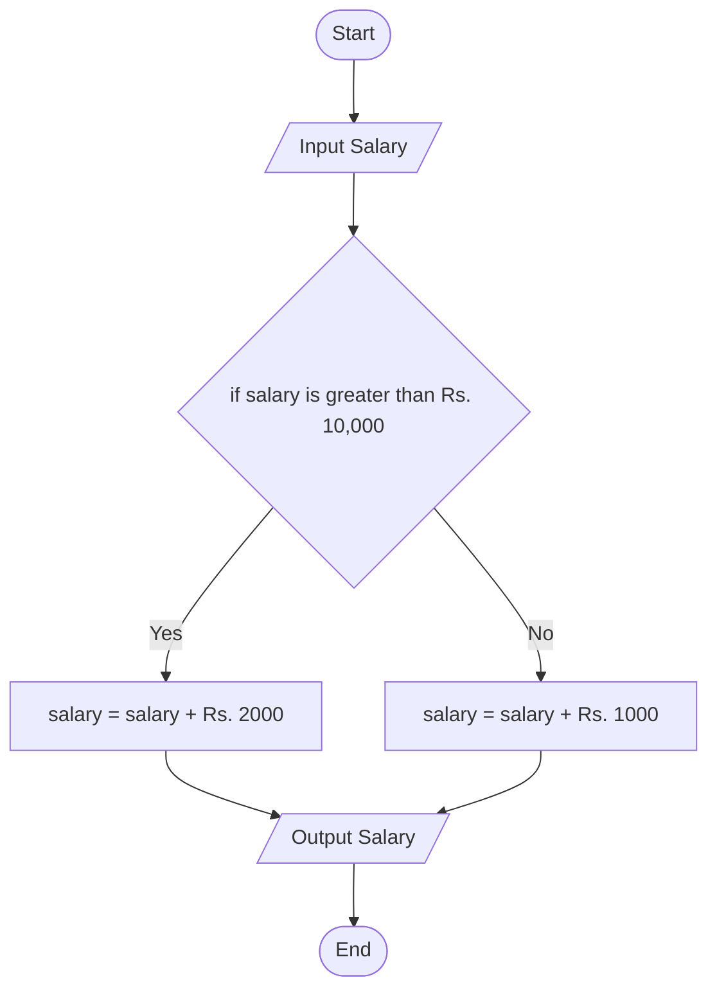
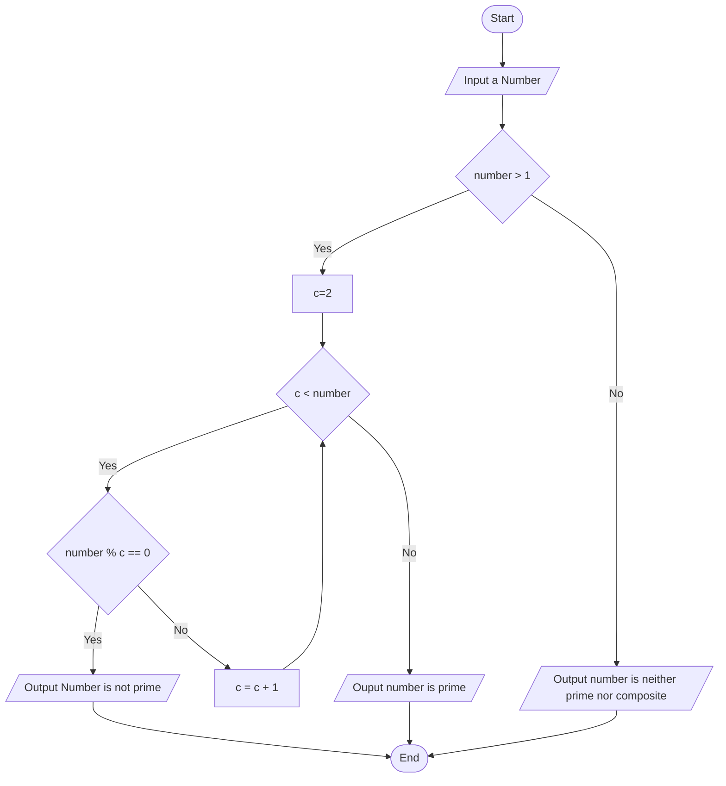

# 🚀Flow of Program

## 📊Flow Chart 
* **Flowchart:** The visualistaion of our thought process or algorithm and represent them diagrammatically is aclled flowchart.


### 🧩Symbols being used in a flowchart:


---

* **🟢Start/Stop:** An oval shape indicate the statring and ending points of the flow chart.
* **📥Input/Output:** A parallelogram is used to represent input and output in flow chart.
* **⚙️Processing:** A rectangle is used to represent process such as mathematical computation or variable assignment.
* **🔀Condition:** A diamond shape is used to to represent conditional statement which results in true or false (YEs or No).
* **➡️Flow direction of program:** An arrow shape is used to represent flow of the program.

---

#### 💻Flowchart Examples: 

1. 📝Take a name and output Hello name.


---

2. 💰Take input of salary. If the salary is greater than 10,000 add bonus 2000, otherwise add bonus as 1000.


---

3. 🔢Input a number and print whether it is prime or not.


---


## 📝Pseudocode
* It is like a rough code which represemts how the algorithm of a program workd.
* Pseodocode does not require syntax.


### 📐Pseudocode of Example 2 (Salary Bonus)
```
Start

Input Salary
if Salary > 10000:
    Salary = Salary + 2000
else:
    Salary = Salary + 1000
end if
Output Salary

Exit
```

### 🔍Pseodocode of Example 3 (Prime Number Check)
```
Start 

Input num
if num <= 1:
    print "Neither Prime nor Composite"
    Exit
end if
c = 2
while c < num:
    if num % c = 0:
        Output "Not Prime"
        Exit
    end if
    c = c + 1
end while
Output "Prime"

Exit
```