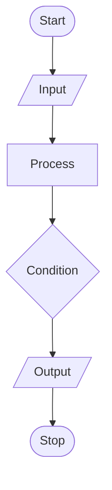
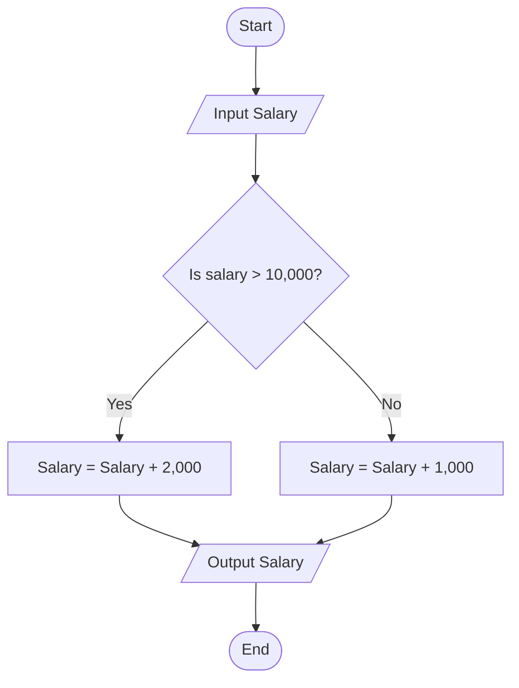
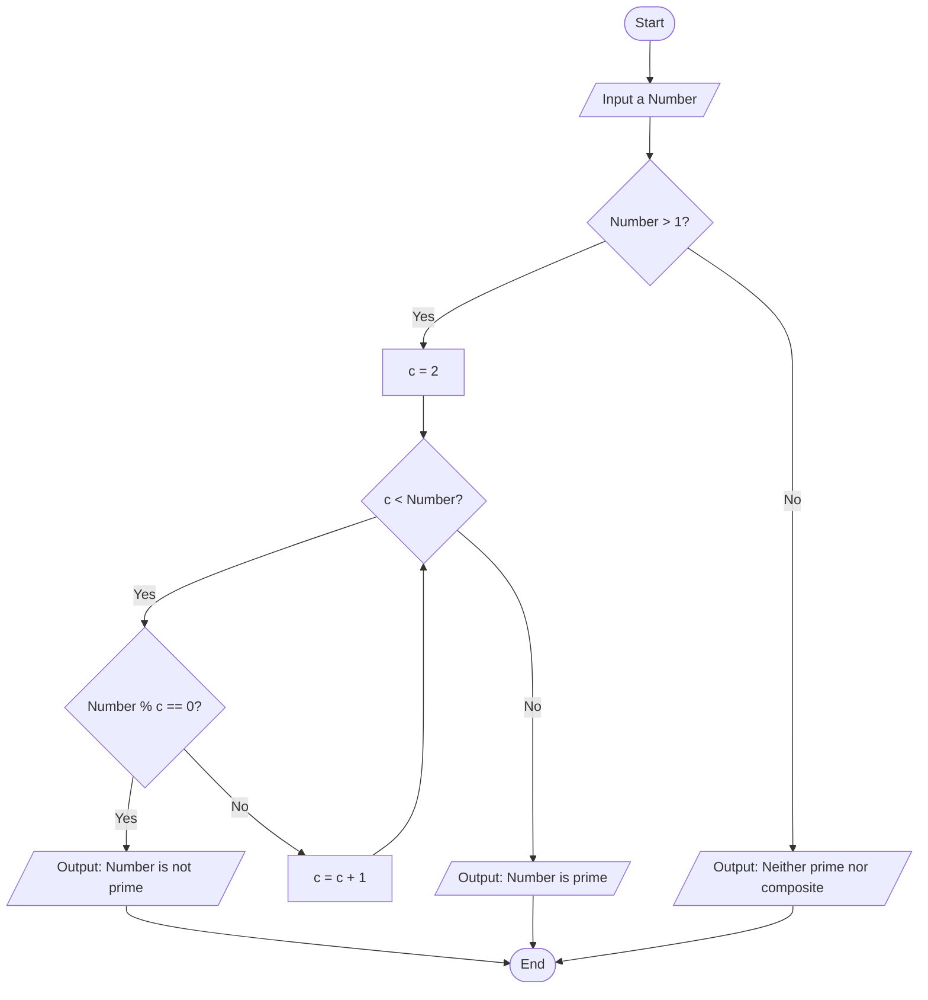

# 🚀 Flow of Program

## 📊 Flowcharts 
* **Flowchart:** A flowchart is the visual representation of an algorithm or a thought process, mapping out the steps diagrammatically.

### 🧩 Symbols Used in a Flowchart


---

 * **🟢 Start/Stop:** An oval shape indicates the starting and ending points of a program's execution flow.
 * **📥 Input/Output:** A parallelogram is used to represent reading inputs or printing outputs.
 * **⚙️ Processing:** A rectangle represents processing steps, such as mathematical computations or variable assignments.
 * **🔀 Condition:** A diamond shape represents a conditional decision point, branching the flow based on a True/False (Yes/No) result.
 * **➡️ Flow Direction:** Arrows direct the sequence of execution through the program.

 ---

#### 💻 Flowchart Examples

**1. Take a name as input and output "Hello {Name}".**


**2. Take a salary amount as input. If the salary is greater than 10,000, add a bonus of 2,000; otherwise, add a bonus of 1,000.**



**3. Input a number and determine whether it is a prime number or not.**



---

## 📝 Pseudocode

 * Pseudocode is an informal, high-level description of an algorithm's structural logic.
 * It mimics code structure but focuses on human readability, completely omitting strict language syntax rules.

### 📐 Pseudocode for Example 2 (Salary Bonus)

```text
Start

Input Salary
If Salary > 10000 Then
    Salary = Salary + 2000
Else
    Salary = Salary + 1000
End If
Output Salary

Exit

```

### 🔍 Pseudocode for Example 3 (Prime Number Check)

```text
Start 

Input num
If num <= 1 Then
    Print "Neither Prime nor Composite"
    Exit
End If
c = 2
While c < num Do
    If num % c == 0 Then
        Output "Not Prime"
        Exit
    End If
    c = c + 1
End While
Output "Prime"

Exit

```