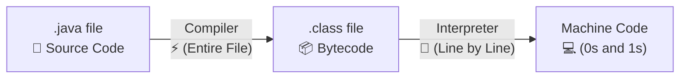
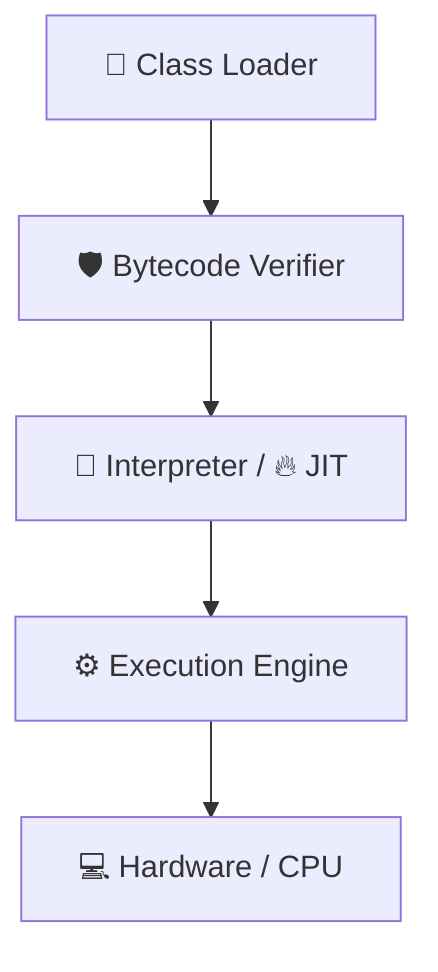
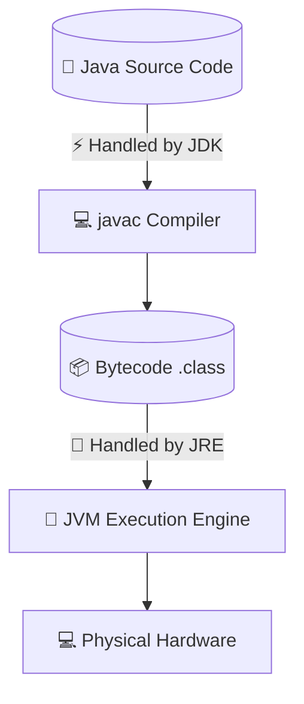

 # ☕ Java — The Complete Execution & Architecture Notes

## ⚙️ The Process of Execution

---

### 📄 Source Code
 * The code written in Java is **human-readable** and saved with the **.java** extension.
 * This raw code is known as the **Source Code**.

### 🛠️ Java Compiler (javac)
 * The Java compiler converts your source code into an intermediate format called **Bytecode**, saved with a **.class** extension.
 * Bytecode cannot run directly on your physical hardware; it requires the **JVM (Java Virtual Machine)** to execute.
 * This intermediate step is the secret behind why Java is **platform-independent**.

### 🎯 Java Interpreter
 * Converts the bytecode into **Machine Code** (binary 0s and 1s) that your computer's CPU understands.
 * It translates and executes the bytecode **line-by-line**.

--- 

## 🌍 Understanding Platform Independence

 * **Write Once, Run Anywhere (WORA):** Bytecode (.class) can run on any Operating System (Windows, Mac, Linux) as long as that system has a JVM installed.

 * **Compilation Comparison:**
   * **C / C++:** Compiles directly into a native .exe file. This executable is tailored to a specific OS, making it **platform-dependent**.
   * **Java:** Compiles into bytecode. The **bytecode is platform-independent**, but the **JVM itself is platform-dependent** (there are specific JVM versions for Windows, Mac, and Linux to talk to their respective hardware).

--- 

## 🏛️ Architecture of Java

| Component | What it Contains | Core Purpose |
|---|---|---|
| **🧰 JDK** (Java Development Kit) | JRE + Development Tools (javac, jar, etc.) | Used by developers to **write, compile, and debug** Java code. |
| **📦 JRE** (Java Runtime Environment) | JVM + Core Class Libraries | Provides the minimum environment required to **run** Java applications. |
| **🚀 JVM** (Java Virtual Machine) | JIT Compiler + Interpreter + Memory | Physically **executes** the bytecode into machine-readable instructions. |
| **🔥 JIT Compiler** (Just-In-Time) | Embedded inside the JVM | Dynamically speeds up performance by compiling repeated code on the fly. |

---

## 🧱 Deep Dive: JDK vs. JRE

### 🧰 JDK (Development Kit)
Provides the full environment to **develop** and **run** Java programs. It includes:
 * **Development Tools:** Command-line utilities to manage your code.
 * **JRE:** The runtime environment to test and run your apps.
 * **javac:** The official Java Compiler.
 * **jar:** The archiver tool to bundle your code into a single file.
 * **javadoc:** The documentation generator.

### 📦 JRE (Runtime Environment)
An installation package that contains *only* what is necessary to **execute** pre-compiled Java programs. It consists of:
 * **Deployment Technologies** (e.g., deployment locks).
 * **User Interface Toolkits** (AWT, Swing).
 * **Integration & Base Libraries** (Math, Util, Lang, etc.).
 * **JVM** (The engine that runs the code).

---

## ⏳ Compile-Time vs. Runtime

### 🔧 Compile-Time

 * **Phase 1:** The developer writes code (.java).
 * **Phase 2:** The compiler checks for syntax errors and converts it to a bytecode file (.class).

### 🏃 Runtime

--- 
When you hit run, the following security and execution steps happen inside the JVM:

#### 1. 📂 Class Loader Subsystem
 * **Loading:** Reads the .class file, generates corresponding binary data, and creates a unique Class object in the Heap memory.
 * **Linking:**
   * *Verification:* Ensures the bytecode structural correctness (checks if it's safe to run).
   * *Preparation:* Allocates memory for class/static variables and assigns them default initial values.
   * *Resolution:* Replaces symbolic references in the code with direct memory references.
 * **Initialization:** Executes all static blocks and assigns actual values to static variables as written in your code.

#### 2. ⚙️ Execution Engine
 * **🎯 Interpreter:** Reads and executes bytecode instructions line-by-line. While fast to start, it is slow when executing the same method repeatedly.
 * **🔥 JIT (Just-In-Time) Compiler:** Monitors code performance. If a section of code (like a loop or method) is repeated frequently ("hot code"), JIT compiles it directly into native machine code so it can skip interpretation next time. This drastically accelerates execution speed.
 * **🗑️ Garbage Collector (GC):** Automatically tracks and deletes unreferenced objects in the Heap memory to prevent memory leaks.

---

## 🔄 Summary: Java Architecture Workflow

