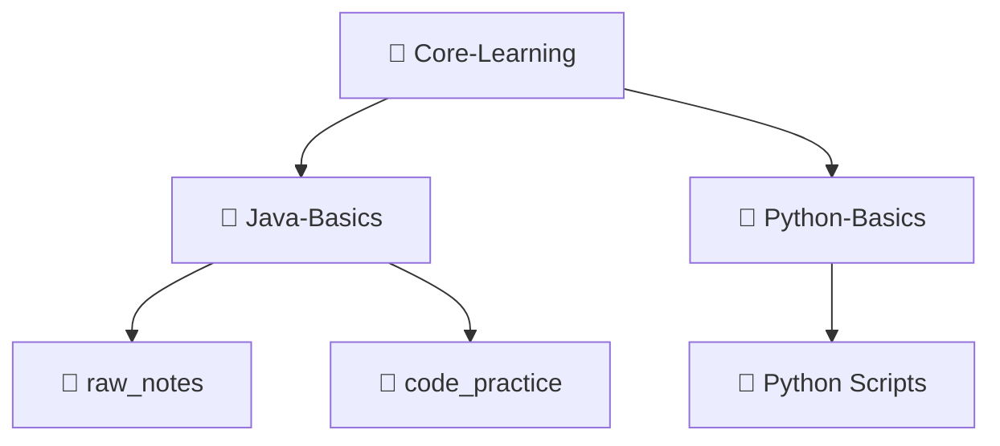

# 🚀 Core-Learning Hub

  

Welcome to my personal core learning repository! This workspace is dedicated to tracking my progress, organizing structured notes, and building utility scripts as I dive deep into programming languages and technologies.

---

## 📂 Repository Structure

The workspace is organized into distinct, specialized modules:

### ☕ 1. Java Basics
 * **raw_notes/**: Structured Markdown notes mapping out core theoretical concepts.
   * 01_git_github.md — Git guides and command workflows.
   * 02_introduction_to_programming.md — Fundamental coding building blocks.
   * 03_flow_of_program.md — Detailed process execution and control flows with Mermaid diagrams.
   * 04_introduction_to_java.md — JVM, JRE, JDK internal execution architecture.
 * **code_practice/**: Hand-on executable files (like Main.java) to test compilation and runtime environments.

### 🐍 2. Python Basics
A collection of script-based projects and command-line automation tools:
 * **goal_tracker.py** — A custom dashboard to configure, manage, and persist specific study targets and execution goals (saves to my_goals.txt).
 * **secret_vault.py** — A secure tracker featuring clean access control logic and comprehensive inline documentation.
 * **sys_dashboard.py** — A system health script providing quick terminal insights with interactive user exit loops.
 * **calculator.py & guess_game.py** — Logic-building interactive terminal tools.

---

## 🛠️ Tech Stack & Tools

 * **Languages:** Python 3.x, Java
 * **Editor:** Visual Studio Code (VS Code)
 * **Version Control:** Git & GitHub (Using structured conventional commits)
 * **Visualization:** Mermaid.js for architectural diagrams

---

## 📈 Git Commit Philosophy

This repository strictly follows clear commit types to track historical changes accurately:
 * Feat: For adding functional code capabilities or new scripts.
 * Docs: For finalizing chapters, hyperlinking files, or extending markdown guides.
 * Style: For moving, restructuring, or organizing directories without changing functionality.

*Happy Coding! 💻*
